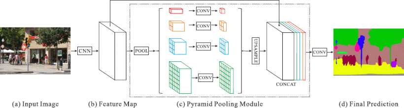
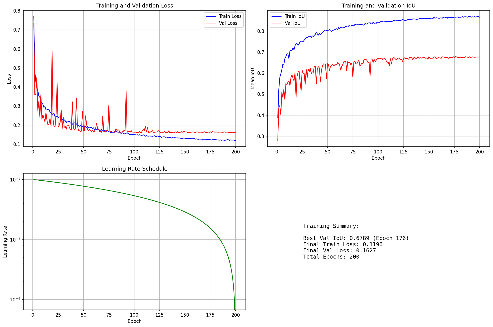
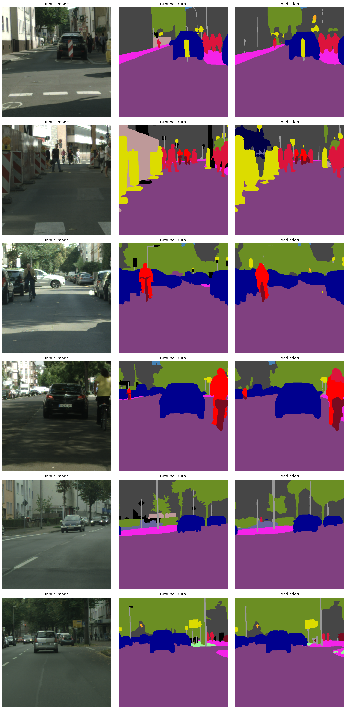
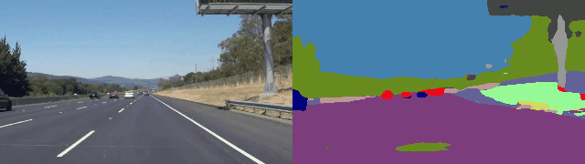
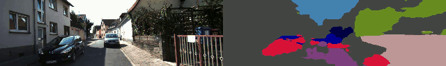
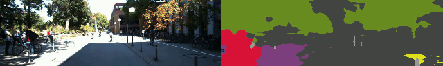

# PSPNet Urban Scene Segmentation for Autonomous Driving

[](https://www.python.org/downloads/)
[](https://pytorch.org/)
[](https://opensource.org/licenses/MIT)

This project implements road and drivable area segmentation using the PSPNet (Pyramid Scene Parsing Network) architecture on the Cityscapes dataset. The model performs semantic segmentation to identify 19 urban scene classes including roads, sidewalks, vehicles, pedestrians, and other critical elements for autonomous driving perception.



*PSPNet Architecture with Pyramid Pooling Module - Original paper by Zhao et al.*

---

## Dataset

**Cityscapes Semantic Segmentation (19 Classes)**

The Cityscapes dataset can be obtained in two ways:

**Option 1: Kaggle Dataset (Recommended - Pre-structured)**
- **Direct Download**: [Cityscapes Train/Val on Kaggle](https://www.kaggle.com/datasets/markmoawad/cityscapes-trainval/data)
- **Size**: ~8.9GB (train + val only, flattened structure)
- **Ready to use**: Extract directly to `data/dataset/`
- **No preprocessing needed**

**Option 2: Official Cityscapes Website**
- **Dataset Source**: [Cityscapes Dataset](https://www.cityscapes-dataset.com/)
- **Required Files**: 
  - `leftImg8bit_trainvaltest.zip` (11GB) - RGB images (only train and val needed)
  - `gtFine_trainvaltest.zip` (241MB) - Fine annotations (only train and val needed)
- **Note**: Test set labels are not publicly available, so only train and val splits are used
- **Requires manual extraction and flattening of city subdirectories**

**Dataset Details:**
- **Original Resolution**: 1024×2048 pixels
- **Training Resolution**: 512×512 random crop (original resolution preserved)

### Class Definitions:

| Class ID | Category | Color (RGB) | Description |
|----------|----------|-------------|-------------|
| 0 | road | (128, 64, 128) | Drivable road surface |
| 1 | sidewalk | (244, 35, 232) | Pedestrian walkways |
| 2 | building | (70, 70, 70) | Buildings and structures |
| 3 | wall | (102, 102, 156) | Walls and barriers |
| 4 | fence | (190, 153, 153) | Fences and railings |
| 5 | pole | (153, 153, 153) | Poles and posts |
| 6 | traffic light | (250, 170, 30) | Traffic light signals |
| 7 | traffic sign | (220, 220, 0) | Traffic signs and markers |
| 8 | vegetation | (107, 142, 35) | Trees and plants |
| 9 | terrain | (152, 251, 152) | Natural terrain |
| 10 | sky | (70, 130, 180) | Sky region |
| 11 | person | (220, 20, 60) | Pedestrians |
| 12 | rider | (255, 0, 0) | Cyclists and motorcyclists |
| 13 | car | (0, 0, 142) | Cars and small vehicles |
| 14 | truck | (0, 0, 70) | Trucks and large vehicles |
| 15 | bus | (0, 60, 100) | Buses |
| 16 | train | (0, 80, 100) | Trains and trams |
| 17 | motorcycle | (0, 0, 230) | Motorcycles |
| 18 | bicycle | (119, 11, 32) | Bicycles |

This comprehensive 19-class segmentation is essential for:
- Complete scene understanding for autonomous navigation
- Obstacle detection and path planning
- Traffic rule compliance and safety systems
- Multi-class object recognition for ADAS

---

## Results & Performance

### Training Statistics (200 Epochs)

| Metric | Value |
|--------|-------|
| **Best Mean IoU** | **67.9%** |
| **Best Validation Loss** | 0.161 |
| **Best Epoch** | 176 |
| **Training Resolution** | 512×512 (random crop) |
| **Batch Size** | 16 |
| **GPU** | NVIDIA RTX 4090 |
| **Training Time** | ~30 hours (~9 min/epoch) |
| **Inference Speed** | ~8-10 FPS (GPU) |

### Training Curves



The model demonstrates excellent convergence with steady decrease in training and validation loss, consistent improvement in mean IoU metric, and effective multi-class segmentation performance.

---

## Prediction Examples



The model accurately segments:
- **Purple regions**: Roads (128, 64, 128)
- **Pink regions**: Sidewalks (244, 35, 232)
- **Light blue regions**: Sky (70, 130, 180)
- **Dark blue regions**: Cars and vehicles (0, 0, 142)
- **Red regions**: Riders and cyclists (255, 0, 0)
- **Dark red regions**: Pedestrians (220, 20, 60)
- **Gray regions**: Buildings and infrastructure (70, 70, 70)
- **Green regions**: Vegetation (107, 142, 35)
- **Yellow regions**: Traffic signs (220, 220, 0)
- **Orange regions**: Traffic lights (250, 170, 30)

---

## Video Inference Demonstrations

The model performs real-time segmentation on various driving scenarios:

### Highway Driving





### Residential Area



### Campus Environment


#### Difficult Conditions


---

## Model Architecture

### PSPNet Implementation Details

The PSPNet architecture consists of:

**Encoder (Feature Extraction)**
- Pretrained ResNet-50 backbone (or ResNet-101)
- Dilated convolutions for dense feature extraction
- Multi-scale context aggregation

**Pyramid Pooling Module**

- 4-level spatial pyramid pooling: 1×1, 2×2, 3×3, 6×6
- Captures context at multiple scales (global to local)
- Feature fusion via concatenation and 1×1 convolution

**Auxiliary Branch (Training Only)**

- Attached to the middle layer (ResNet layer3) for deep supervision
- 1024-channel feature map → 19-class segmentation
- Weighted by 0.4 in total loss calculation
- Helps optimize the learning process and improve feature discrimination
- **Disabled during inference** for final predictions

**Decoder**
- Upsampling to original resolution
- Final convolution for 19-class pixel-wise classification

**Output Layer**
- Softmax activation for multi-class probabilities
- **Total Parameters**: ~49M (ResNet-50 backbone)

### Training Configuration

```python
Loss Function: CrossEntropyLoss (ignore index 255)
Optimizer: SGD with momentum (0.9)
Learning Rate: 0.01 (polynomial decay with power=0.9)
Batch Size: 16 (RTX 4090)
Input Resolution: 512×512 random crop (full resolution preserved)
Output Classes: 19
Data Split: Train (2975 samples) / Val (500 samples)
Auxiliary Loss Weight: 0.4
Epochs: 200
```

---

## Quick Start

### Prerequisites
- Python 3.8+
- CUDA-capable GPU (recommended for training)
- 8GB+ GPU VRAM
- 20GB+ disk space for dataset

### Installation

1. **Clone the repository**
```bash
git clone https://github.com/Mark-Moawad/PSPNet-Road-Segmentation.git
cd PSPNet-Road-Segmentation
```

2. **Create virtual environment**
```bash
python -m venv venv
source venv/bin/activate  # On Windows: venv\Scripts\activate
```

3. **Install dependencies**
```bash
pip install -r requirements.txt
```

4. **Download Cityscapes dataset**

**Option A: Kaggle (Recommended)**
```bash
# Download from https://www.kaggle.com/datasets/markmoawad/cityscapes-trainval/data
# Extract to data/dataset/ - structure is already correct!
```

**Option B: Official Cityscapes**
- Register at [https://www.cityscapes-dataset.com/](https://www.cityscapes-dataset.com/)
- Download `leftImg8bit_trainvaltest.zip` and `gtFine_trainvaltest.zip`
- Extract and flatten city subdirectories into the structure below

**Expected directory structure:**

```
data/dataset/
├── leftImg8bit/
│   ├── train/
│   │   ├── aachen_000000_000019_leftImg8bit.png
│   │   ├── aachen_000001_000019_leftImg8bit.png
│   │   └── ... (2975 images)
│   └── val/
│       ├── frankfurt_000000_000019_leftImg8bit.png
│       ├── frankfurt_000001_000019_leftImg8bit.png
│       └── ... (500 images)
└── gtFine/
    ├── train/
    │   ├── aachen_000000_000019_gtFine_labelIds.png
    │   ├── aachen_000001_000019_gtFine_labelIds.png
    │   └── ... (2975 labels)
    └── val/
        ├── frankfurt_000000_000019_gtFine_labelIds.png
        ├── frankfurt_000001_000019_gtFine_labelIds.png
        └── ... (500 labels)
```

---

## Usage

### Training from Scratch

```bash
python pspnet_segmentation.py
```

The script automatically:
1. Loads the Cityscapes dataset from `data/dataset/`
2. Uses train/val split (train for training, val for validation and evaluation)
3. Trains the PSPNet model with polynomial learning rate decay
4. Saves the best model checkpoint based on validation IoU
5. Generates training curves and prediction visualizations

### Video Inference

To run inference on your own driving videos:

1. **Enable video processing** in `pspnet_segmentation.py`:
```python
process_videos_flag = True
```

2. **Place videos** in `data/testing_videos/`

3. **Run inference**:
```bash
python pspnet_segmentation.py
```

Output videos with overlaid segmentation masks will be saved to `data/processed/`.

## Project Structure

```
PSPNet-Road-Segmentation/
├── pspnet_segmentation.py        # Main training & inference pipeline
├── utils.py                       # Utility functions (metrics, visualization)
├── requirements.txt               # Python dependencies
├── README.md                      # This file
│
├── data/
│   ├── dataset/                   # Cityscapes dataset (manual download or Kaggle)
│   │   ├── leftImg8bit/          # RGB images
│   │   │   ├── train/           # 2975 training images (flattened)
│   │   │   └── val/             # 500 validation images (flattened)
│   │   ├── gtFine/               # Fine annotations
│   │   │   ├── train/           # 2975 training labels (flattened)
│   │   │   └── val/             # 500 validation labels (flattened)
│   │   └── testing_videos/       # Test videos for inference
│   ├── models/                    # Trained model checkpoints
│   │   └── PSPNet_baseline.pt    # Best model weights
│   ├── outputs/                   # Training visualizations
│   │   ├── PSPNet_baseline_training_curves.png
│   │   └── PSPNet_baseline_predictions.png
│   └── processed/                 # Inference output videos
│
├── media/                         # Photos and demo videos for README
│
└── .venv/                         # Python virtual environment
```
---

## References

- **PSPNet Paper**: [Pyramid Scene Parsing Network](https://arxiv.org/abs/1612.01105) (Zhao et al., 2017)
- **Cityscapes Dataset**: [The Cityscapes Dataset for Semantic Urban Scene Understanding](https://arxiv.org/abs/1604.01685) (Cordts et al., 2016)
- **Cityscapes Official**: [https://www.cityscapes-dataset.com/](https://www.cityscapes-dataset.com/)

---

## License

This project is licensed under the MIT License - see the [LICENSE](LICENSE) file for details.

---

## Author

**Mark Moawad**  
*Perception Engineer | Computer Vision Specialist*

This project demonstrates practical computer vision and deep learning skills for autonomous driving applications, showcasing end-to-end development from model training to production-ready inference.

---

## Acknowledgments

- Original PSPNet architecture by Zhao, Shi, Qi, Wang, and Jia
- Cityscapes dataset team at Daimler AG and TU Darmstadt
- PyTorch and segmentation_models_pytorch communities
---

## Contact

For questions, collaboration opportunities, or professional inquiries:
- GitHub: [@Mark-Moawad](https://github.com/Mark-Moawad)
- Email: [mark.moawad96@gmail.com](mark.moawad96@gmail.com)
- LinkedIn: [https://www.linkedin.com/in/markmoawad96/](https://www.linkedin.com/in/markmoawad96/)

